# IskoMed

## Group Details
    CMSC 23 B-7L Group 2

    Developers:
        Arawela Lou G. Delmo
        Gabrielle Bailey P. Fuentes
        Aleezah Maye P. Rolle
        Jerico P. Sabile

## Program Description
IskoMed: A Health Monitoring App

IskoMed is a mobile application designed to facilitate the monitoring and tracking of individuals, specifically UPLB constituents, during quarantine periods, particularly in the context of COVID-19. The program offers a user-friendly interface and provides distinct views for users, administrators, and entrance monitors. 

It helps ensure the health and safety of individuals while providing efficient administration and monitoring capabilities for authorized personnel. The program streamlines the process of recording health entries, managing quarantine statuses, and facilitating communication between users, administrators, and entrance monitors.

## Installation Guide
    1. Open terminal.
    2. Make sure that you are on the base folder of your flutter app.
    3. Run `flutter pub get` to get all dependencies needed
    4. Run `flutter build apk --release` to build the apk
    5. Once the command has finished running, the terminal will show a path where you can find your apk.
    6. Download the apk on your phone.
    7. You can now start using the app.

## User Guide
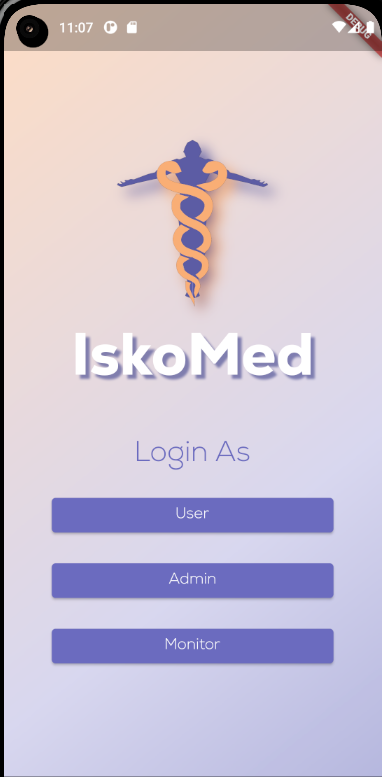
Here is a flow of the application based on the provided screens and functionalities:

1. User's View:

   - The user signs in or signs up with their credentials.

   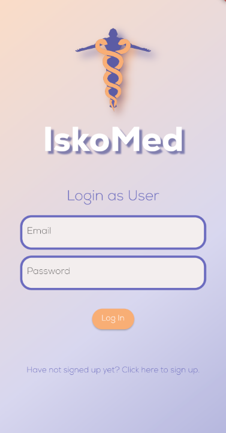

   - After signing up, the user provides their personal information, including pre-existing illnesses.

   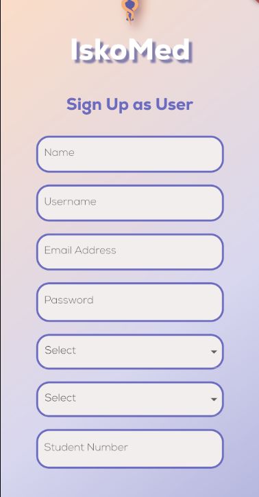

   - Upon successful authentication, the user is directed to the homepage.

   - The homepage displays a list of entries, showing the user's previous health records.

   - The user's quarantine status is indicated on the homepage.

   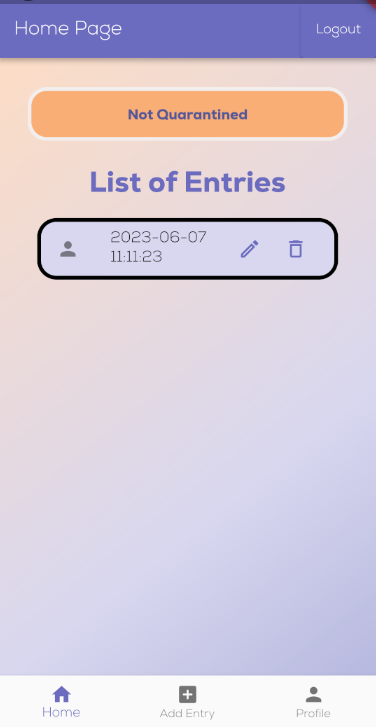

   - The user can access their profile, which includes a QR code (building pass) that is generated daily.

   - The QR code cannot be generated if the user is quarantined, experiencing symptoms, or has no health entry.

   

   - The user can add a new entry for the current day, providing their health status and symptoms.

   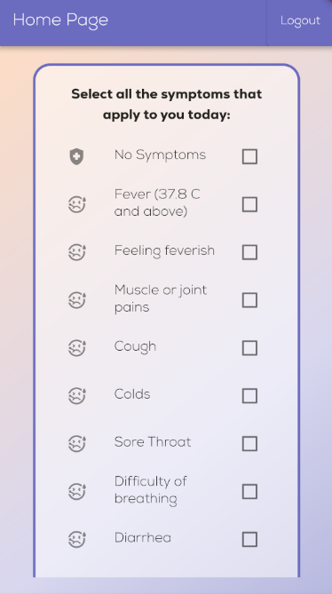

   - The user can request to edit or delete their today's entry, which needs approval from the admin.

2. Admin's View:

   - The admin signs in or signs up with their credentials.
    
   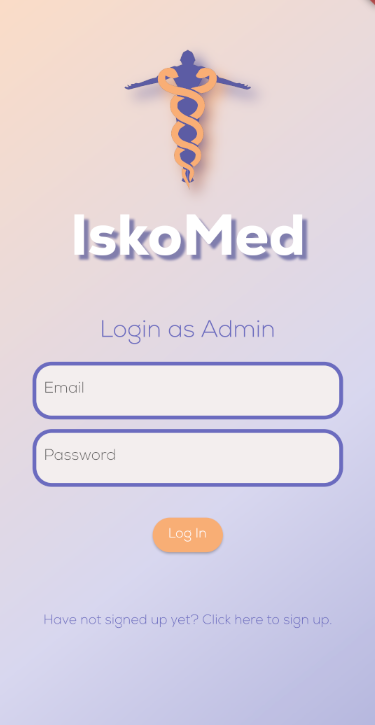

   - During the sign-up process, the admin provides their personal information, such as name, employee number, position, and home unit.

   - After successful authentication, the admin gains access to various administrative functions.
    
   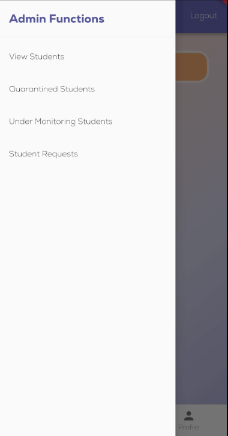

   - The admin can view all students' records or search for specific students using filters like date, course, college, or student number.

   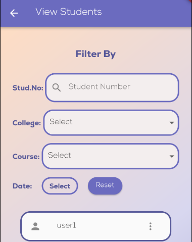

   - The admin can add students to quarantine and maintain a count of the number of students in quarantine.

   - The admin can view the list of quarantined students and remove them from quarantine if necessary.
       
   

   - The admin can view students who are under monitoring and can choose to move them to quarantine or end the monitoring period.

   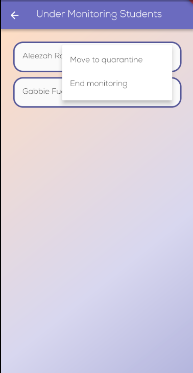

   - The admin can approve or reject requests from users to delete or edit their today's entry.
    
   

   - The admin can elevate a user's type from default user to admin or monitor.

   - The admin can perform all the functionalities available in the user's view.

3. Entrance Monitor:

   - The entrance monitor signs in or signs up with their credentials.

   - During the sign-up process, the entrance monitor provides their personal 
   information, such as name, employee number, position, and home unit.

   - After successful authentication, the entrance monitor gains access to monitor-related functions.
       
   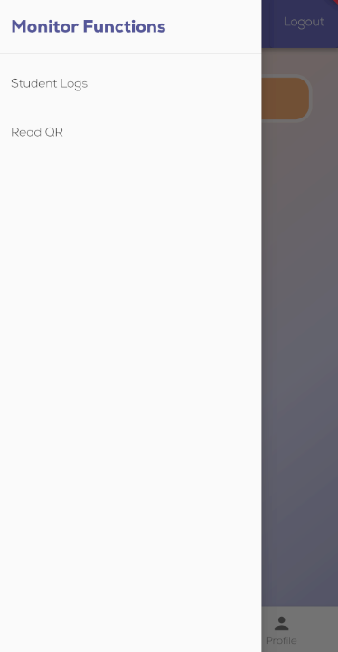

   - The entrance monitor can search student logs to retrieve information about their entries.

   - The monitor can view the logs of students who entered the premises.

   

   - The monitor can read the generated QR codes to verify the user's status.
       
   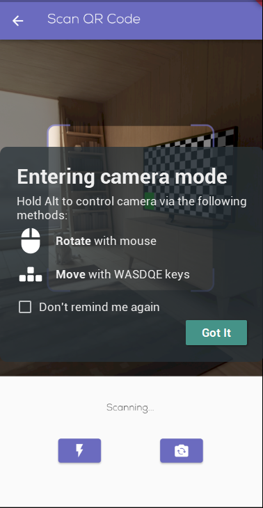

   - The monitor can update the logs, including location, student number, and status (cleared, under monitoring, under quarantine).

   - The entrance monitor can perform all the functionalities available in the user's view.